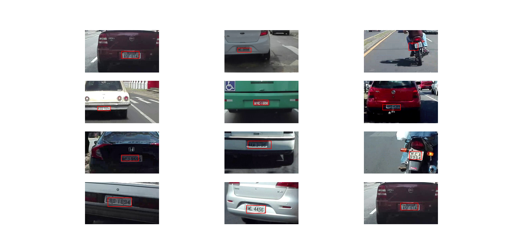

# License-plate-Detection

## Transfer Learning with mobilenet for license plate bounding box regression task

### Run the generate_dataset.py to generate cropped images with respective transformations

### Dataset used is the UFPR - ALPR License plate dataset. (Dataset is not present in the repo)

### Further changes with respect to model architecture and adding an OCR architecture for License plate text recognition have to be made.

#### Documentation in the code and the readme will be updated as the project is in progress.

